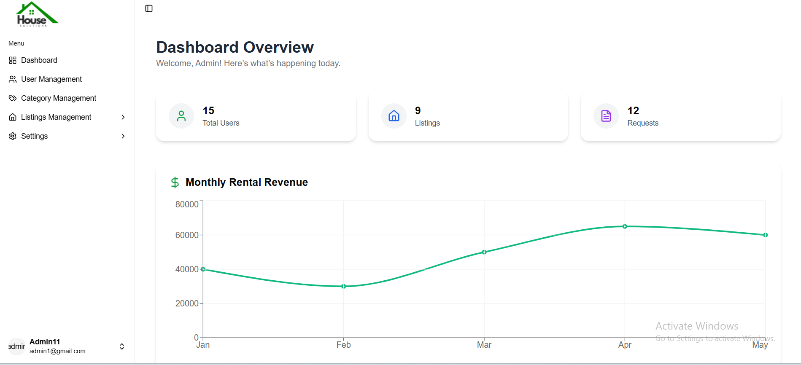

🏡 BasaFinder – Smart Rental & Housing Solution

BasaFinder is a full-stack web application that connects landlords, tenants, and admins to streamline the rental housing process. It offers secure authentication, role-based dashboards, and a seamless user experience from property listing to payment.

## 🌐 Live Demo

🔗 [Frontend Live Link](https://basefinder-client.vercel.app)

🚀 Features
👥 User Roles
Admin: Manages all users and rental listings.

Landlord: Posts and manages rental listings, handles rental requests.

Tenant: Searches listings, submits rental requests, and completes payments.

🧩 Core Functionalities

🔐 Authentication with JWT & bcrypt

🏘️ Rental Listings with rich info and multiple images

🔍 Search & Filter by location, price, bedrooms

📄 Rental Requests flow with approval and rejection system

💳 Payment Integration (ShurjoPay)

📬 Email Notifications

📊 Role-Based Dashboards

🖥️ Frontend
🔧 Tech Stack
Framework: Next.js (App Router)

Language: TypeScript

Styling: Tailwind CSS

State Management: React Hooks

Deployment: Vercel

📁 Structure Highlights
/app - Route-based pages with SSR/SSG

/components - Reusable UI components

/dashboard - Role-specific dashboard views

/hooks, /utils - Custom logic and helpers

🛠️ Backend
🔧 Tech Stack
Runtime: Node.js

Framework: Express.js

Database: MongoDB (Mongoose)

Authentication: JWT + bcrypt

Deployment:  Render 

📁 API Endpoints

Method	Endpoint	Description
POST	/api/auth/register	Register landlord/tenant
POST	/api/auth/login	Login and get JWT
GET	/api/users	Admin: View all users
POST	/api/listings	Landlord: Add new rental listing
GET	/api/listings	Get all listings
POST	/api/requests	Tenant: Submit rental request
PUT	/api/requests/:id/approve	Landlord: Approve rental request
PUT	/api/requests/:id/reject	Landlord: Reject rental request
POST	/api/payments	Process payment (Stripe/ShurjoPay)
📷 Screenshots## 🖼️ Screenshots

### 🎯 Dashboard View

🧑‍💻 Local Setup
bash
Copy
Edit
# Clone both frontend and backend
git clone https://github.com/yourname/basafinder-frontend.git
git clone https://github.com/yourname/basafinder-backend.git
📦 Backend
bash
Copy
Edit
cd basafinder-backend
npm install
# Add .env with your Mongo URI, JWT secret, etc.
npm run dev
🌐 Frontend
bash
Copy
Edit
cd basafinder-frontend
npm install
# Add .env.local with your backend API URL
npm run dev
🔐 Environment Variables
Frontend
bash
Copy
Edit
NEXT_PUBLIC_API_URL=http://localhost:5000/api
Backend
ini
Copy
Edit
PORT=5000
MONGO_URI=your_mongodb_connection
JWT_SECRET=your_jwt_secret
✨ Future Improvements
🌍 Multi-language support

🏷️ Advanced search filters

📱 Progressive Web App (PWA)

🛎️ Real-time chat between tenant & landlord

🤝 Contributing
Contributions are welcome! Please open an issue or submit a PR.

🧑‍🏫 About the Developer
Md Ashiqur Rahman
Web Developer & Digital Marketer
Mentor at Her Power Project
📧 ashiqur.rahman9796@gmail.com
📱 +8801727504474

